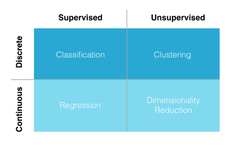

## Introduction to AI and ML

*AI* - machines that perform functions of a human intelligence - decision making, perception

*Machine Learning* - algorithms that can learn from data - reasoning

*Deep Learning* - neural networks learn from large datasets - predicting

Why is AI relevant now? Why is it possible now?
	1. Computing got quicker
	2. The cost of devices has dropped drastically
	3. The amount of data is growing quickly.

#### Industry applications

PWC estimates AI will add 16 trln USD to the world economy

Retail: pricing, promotion, CSM
Consumer goods: SCM, demand forecasting
Finance: marketing, sales, risk assessment and risk management

### Machine Learning

Before approaching a task, you should 2 questions: does the data contain labels and is the data continuous (has numerical labels)? 

==Supervised Learning== maps an input to an output 

Machine Translation, Image classification, face recognition, sentiment analysis, NLP, event detection 

Classification of the data and its labelling
Regression of the numeric data 

==Unsupervised Learning== finds patterns in data 

Clustering data in sections, e.g. clustering the customer paths through an ecommerce website
Association 

==Reinforcement Learning== is about how to teach machines to take an action (maximize an outcome)  

In plain words it's the way to teach machines through mistakes and right answers. You are running a machine through an algorithm that confirms or rejects the machine's answer and this way the machine learns to give correct answers.

### Neural Networks (NN)

NN make a decision based on the information. 

Here comes the concept of weights and threshold, it means that each piece information has different value (weight) and therefore they all cannot be equal. Another thing is a threshold - a minimum which the system cannot make a decision. 

It is necessary to have as many as possible important facts, reasons relevant to the decision making -> would be cool to get ideas from the team.

When there is a multilayered structure of the inputs (some inputs may depend on the lower level of the inputs), it is called neural networks. 

Training requires a lot of data

### What can AI do now?

Similarly to most humans:
	- Optical character recognition
	- Classification of images
	- Handwriting recognition
	- Facial recognition (since 2018)

Worse than most humans
	- Captions/visual descriptions if imagery
	- Various robotics tasks
	- General speech recognition
	- Complex logical reasoning
	- Tasks requiring contextual knowledge: translation and explainability
	- Self-driving cars
