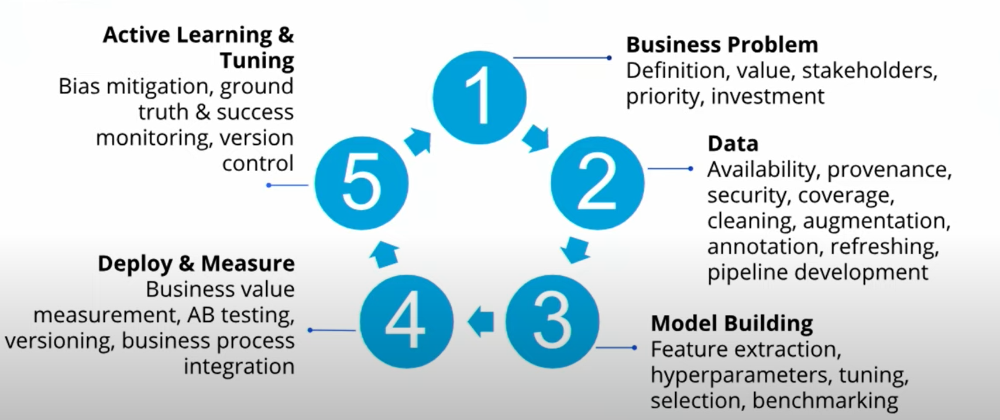
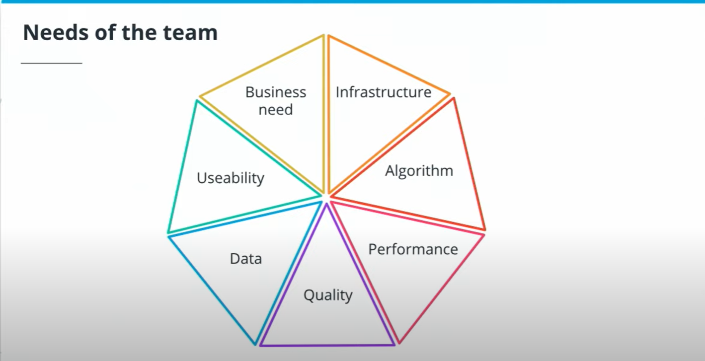
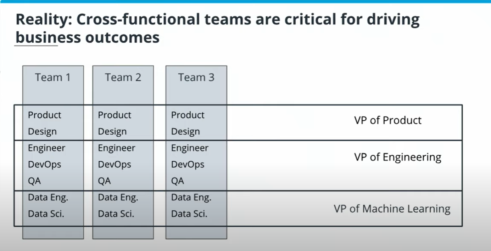
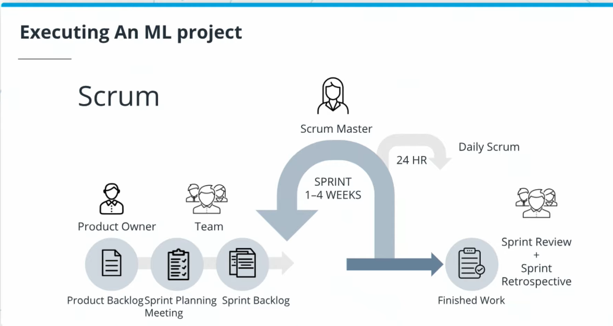

## Using AI and ML in Business

A typical approach to AI starts with the data

Data Ingestion -> Data Cleaning and Transformation -> Model Training -> Testing and Validation -> Deployment

#### An approach that creates business value 

-> Business Problem (definition, value, stakeholders, priority, investment) 
-> Data (availability, security, coverage, cleaning, annotation, pipeline development) 
-> Model Building (feature extraction, tuning, benchmarking) 
-> Deploy and Measure (business value measurement, AB testing, business process integration) 
-> Active Learning and Tuning (bias mitigation, ground truth, version control)

Production systems actively learn from humans. 

### Business Problem Definition and Planning

Here on this step it's important to define how AI adds value.

#### Project Statement 

We have to identify what problem we are solving.
We have to understand what data are needed, the scope - the best option (here not quite clear) based on all variables (e.g. to improve conversion) and the way to measure success. 

Site conversion - an indicator showing how a visitor completes a desired action. 

N of converted visitors / N of all visitors = conversion rate

It's important to narrow the business problem. 

#### Using AI in Business

	1. Deploy for targeted use cases - measurable business outcomes for targeted use cases
	2. It's always better to start with a business case before the data
	3. Success depends on the data. AI Systems are only as good as the data we put into them.

#### Effective metrics for measuring success:
	- Easily measurable
	- Directly correlated to business performance
	- Predictive of future business outcomes
	- Isolated to factors controlled by the group it's measuring
	- Comparable to competitors' metrics
	
### What makes a project well-suited for AI?

#### Key considerations:
	- An impactful business problem that warrants solving
	- Is it possible to quantify the business value clearly and simply?
	- Does the problem have a large volume of associated data?

#### Do you need a traditional ML or Deep Learning (DL) techniques?

Key considerations:
	- DL outperforms with large data sets, ML works better with smaller datasets.
	- DL requires more powerful infrastructure
	- DL is about learning features rather than manually engineering them
	- DL shines when applied to multidimensional problems: image classification, NLP, speech recognition.

Things to remember when you start a project:
- start with a business value and break it down into small and specific component
- get real with the data (use only production data)
- learning from new data ensures constant improvement

Cross-functional teams are critical for driving business outcomes

Key roles:
1. product owner:
	- business case owner
	- connects stakeholders and the team
	- maximizes product value
	- ensures that the team builds the right product
2. designer
	- human computer interaction design
	- visual design, info architecture, interaction design
	- useability/accessability
3. software engineer
	- product infrastructure
	- frontend/backend
4. data engineer
	- builds data infrastructure
	- gets model into production
	- ensures entire pipeline can support rapid development
	- model management
5. data scientist
	- builds and selects models
	- guides the team on the state-of-the-art technology
	- structures the problem to achieve the business metrics
	- uses the data to answer business questions
6. QA team member
	- owns quality assurance of the product
	- ensures product release is ready
	- scalability testing
	- functional testing
7. Development and Operations (DevOps)
	- ensures infrastructure reliability
	- manages scalability and performance
	- mitigates security risks
	- ensures development and ML team can work efficiently

