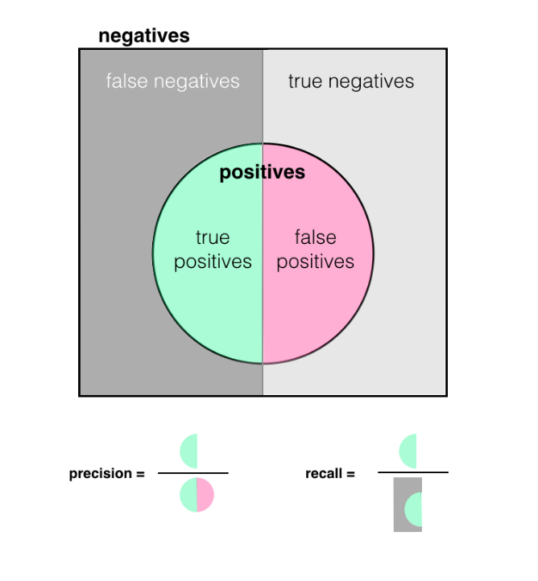

### Buidling a dataset requires answering the following questions:
    - does the dataset fit the problem?
    - is the dataset complete?
    - how can you annotate a dataset and ensure the quality of the data and UI over time?

    Data Size 

    do you have enough data?

    It's important to have sufficient data to achieve your goal. To avoid sampling bias, especially in DL, you need to have a big amount of data. 

    Ensuring Data Fit

    Use production data (generated by users) to ensure the training data matches real-world scenarios.

    Determine the succes criteria for a trained model:
    - precision
    - recall
    - F1 score
    - if not met -> retrain 

    Precision = sum of true positives / sum of all positives

    Recall = sum of true positives / (true positives + false negatives)

Calculating F1 score

F1 Score = 2 * (precision * recall) / (precision + recall)